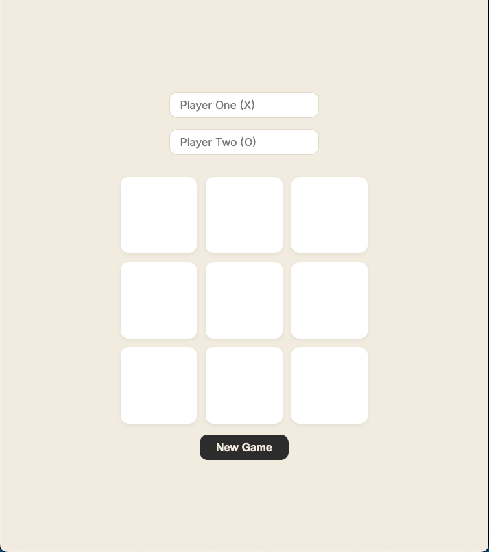

# 🎮 Tic Tac Toe 

A browser-based Tic Tac Toe game built with vanilla JavaScript, HTML, and CSS.



## 🔗 Live Demo
[Play it here](https://malvin149.github.io/tic-tac-toe/)

## 📖 About

This project is a part of [The Odin Project](https://www.theodinproject.com/)'s Javascript course. It was built as a deliberate practice applying factory functions and the module pattern (closures) to structure a small application, following an inside-out approach: game logic first, fully testable from the console, before any DOM/display code.

## ✨ Features

- Two-player local gameplay with win and tie detection
- Custom player names, with sensible defaults
- New Game / reset functionality 
- Clean, minimal UI with a warm-neutral color palette

## 🏗️ Architecture

- `Gameboad` - module (IIFE) managing the private board array 
- `createPlayer` - factory function producing player objects
- `GameController` - module managing turns, win/tie detection, and game state
- `DisplayController` - handles all DOM rendering and event listeners

Each piece is deliberately kept DOM-agnostic except `DisplayController`, which is the only part of the app aware of the page itself.

## 🚀 Running Locally

Clone the repo and open `index.html` in a browser - no build step required.

```
git clone github@github.com:malvin149/tic-tac-toe.git
cd tic-tac-toe
```
